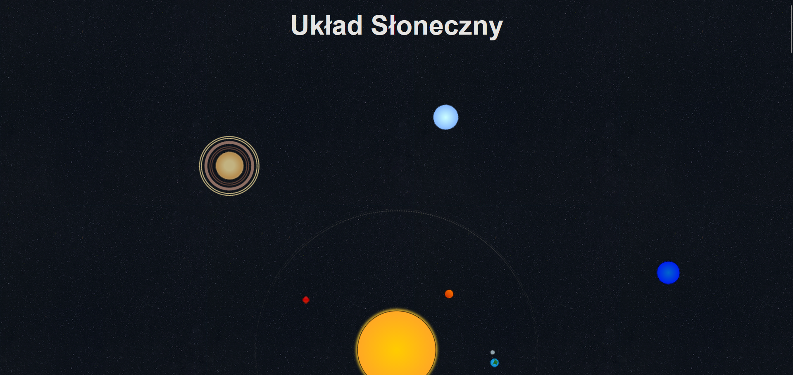
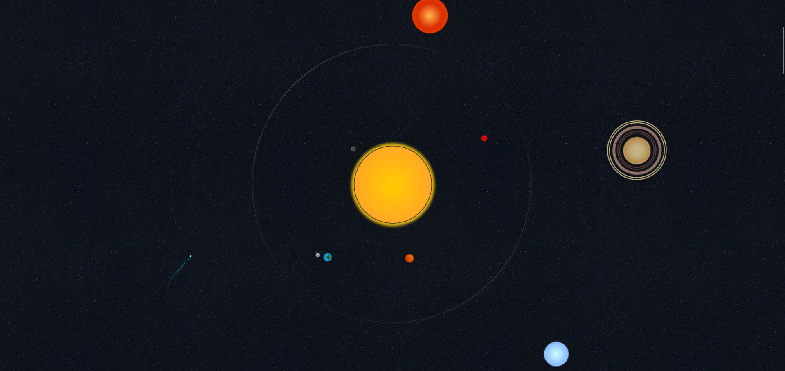
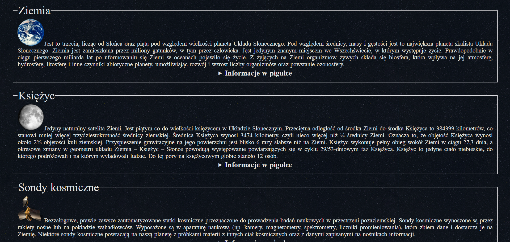
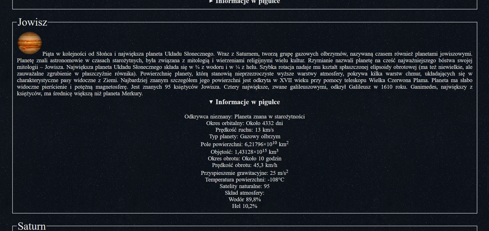

# ***[Projekt Słońce](https://szulczyk.pl/projekt-5/slonce)***

## 🖼️ ***Zrzuty ekranu***

 

## 📄 ***Opis projektu***
### ✅ *Projekt zakończony dnia 02.12.2024*
### *Projekt prezentuje informacje o Układzie Słonecznym oraz dużą animację 2D przedstawiającą planety krążące wokół Słońca. Wszystkie ciała niebieskie zostały ustawione statycznie, co pozwala na czytelne i poglądowe ukazanie ich orbit. W sekcji poniżej animacji użytkownik znajdzie szczegółowe opisy najważniejszych obiektów znajdujących się w naszym układzie planetarnym.*

 

## 🛠️ ***Stack projektu***
- ### *Frontend*
  - ### *HTML5*
  - ### *CSS3*
- ### *Backend*
  - ### *Brak użytych technologii*
- ### *Bazy danych*
  - ### *Brak użytych technologii*

 

## 📌 ***Podsumowanie projektu***
### 🎯 *Głównym założeniem projektu było poglądowe ukazanie Układu Słonecznego za pomocą animacji 2D, odzwierciedlającej wielkość, orbity oraz ruch planet, a także wzbogacenie jej o bazę wiedzy o ciałach niebieskich. Całość została zrealizowana wyłącznie przy użyciu technologii HTML i CSS, co stanowiło kluczowe wyzwanie i cel techniczny tego przedsięwzięcia.*
### 💡 *Czego się nauczyłem:*
- ### *Układanie elementów w CSS - opanowałem, jak sprawnie ustawiać pojemniki i obrazki na stronie, żeby wszystko idealnie do siebie pasowało.*
- ### *Tworzenie płynnych animacji - przećwiczyłem robienie animacji oraz kombinowałem z ich ustawieniami, aby ruch planet wyglądał naturalnie.*
- ### *Sprawne przeszukiwanie sieci - nauczyłem się, jak szybko wyszukiwać w internecie dobrej jakości grafiki oraz rzetelne informacje i selekcjonować je pod kątem projektu.*
- ### *Kreatywne kodowanie bez JS - przekonałem się, jak wiele można wycisnąć z samego HTML i CSS, co zmusiło mnie do szukania niestandardowych rozwiązań.*
- ### *Dbanie o wygląd i estetykę - opanowałem, jak składać wszystko w całość, dobierać kolory i styl, żeby projekt po prostu dobrze się prezentował.*

 

## 📨 ***Kontakt***
- ### 📧 *E-mail -* przemo.ppk@gmail.com
- ### 💻 *Discord -* darkcoder97